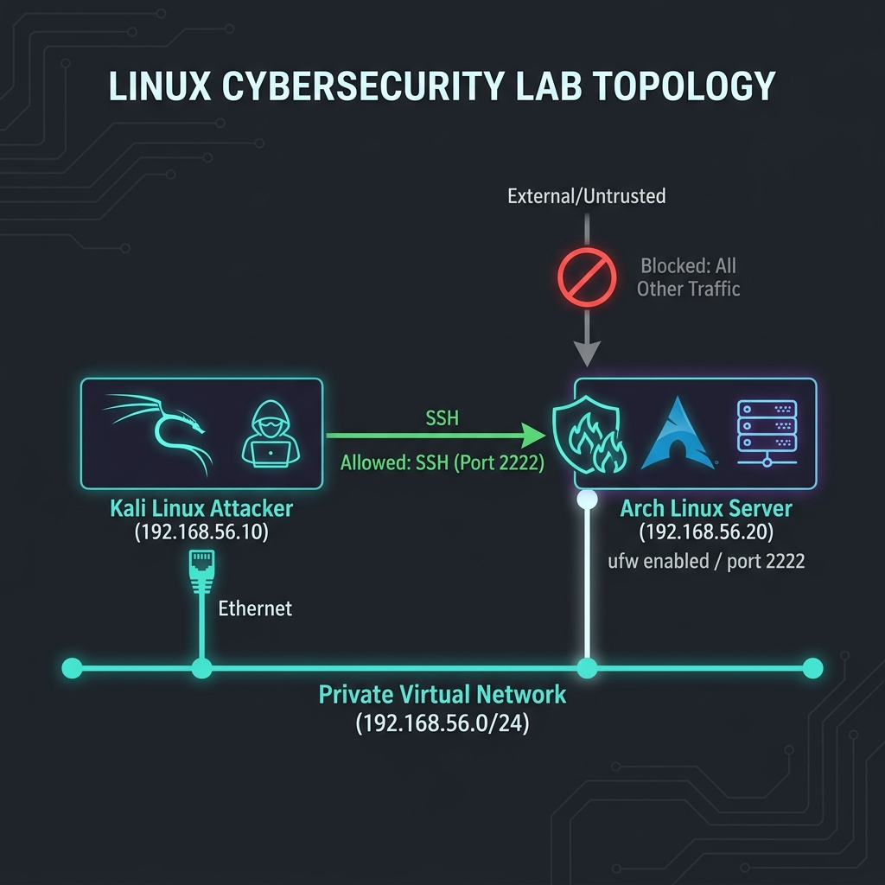
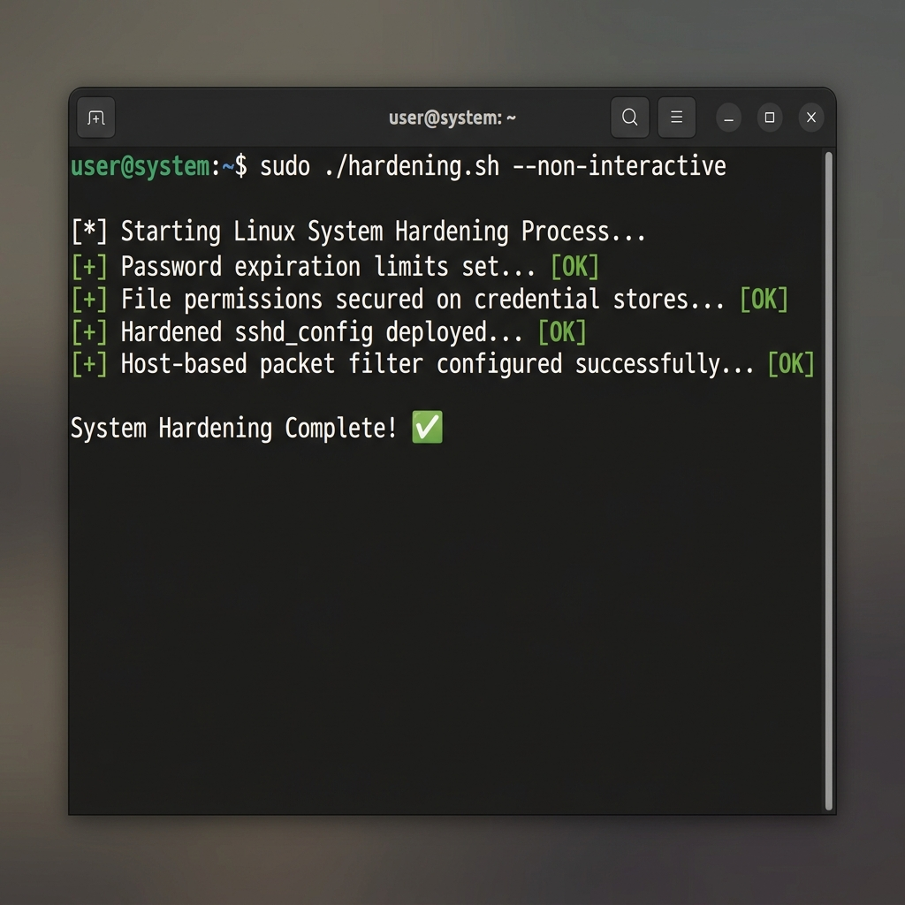
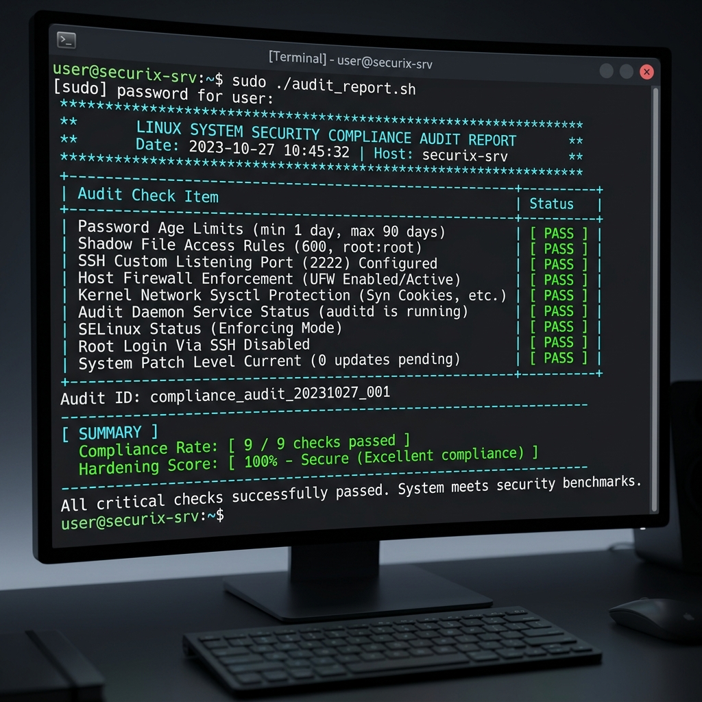

# Linux Infrastructure & Security Lab (Apr 2024 – Jun 2024)

This project configures a virtualized security testing and system hardening lab. It defines an infrastructure consisting of an **Arch Linux target server** and a **Kali Linux audit/attacker node**, connected over an isolated private network. It includes automated shell scripts to apply system hardening policies (ensuring least privilege and configuration compliance) and audit the system against security compliance rules.

## Project Structure

```text
├── configs/
│   ├── audit.rules       # Custom auditd rules for event auditing
│   ├── issue             # System warning legal banner
│   ├── sshd_config       # Hardened SSH configuration
│   └── sysctl.conf       # Hardened kernel and network parameters
├── scripts/
│   ├── audit_report.sh   # Checks system state & outputs compliance score
│   ├── hardening.sh      # Hardens passwords, accounts, SSH, and filesystems
│   └── network_setup.sh  # Sets up host-based firewall access controls
├── screenshots/
│   ├── compliance_audit.png
│   ├── hardening_execution.png
│   └── network_diagram.png
└── Vagrantfile           # Provisions VMs on the private network link
```

---

## 1. Lab Architecture & Network Topology

The environment runs on VirtualBox and is provisioned via Vagrant:
*   **Kali Linux Attacker Node (`192.168.56.10`)**: Used to perform network diagnostics, access control audits, and simulate traffic.
*   **Arch Linux Server Node (`192.168.56.20`)**: The hardened target running custom system security configurations and an active packet filter.
*   **Private Network (`192.168.56.0/24`)**: An isolated subnet ensuring no external untrusted communication interferes with the testing.

### Network Topology Diagram


---

## 2. Hardening Measures Implemented

System security policies are implemented via `scripts/hardening.sh` and custom configuration templates in `configs/`:

1.  **Account & Password Policies**:
    *   Configures password aging requirements (90-day maximum age, 7-day minimum age) in `/etc/login.defs`.
    *   Disables interactive shells for inactive system accounts (sets shell to `/sbin/nologin` for accounts like `bin`, `daemon`, `mail`, `nobody`).
2.  **File System & Least Privilege**:
    *   Locks permissions on sensitive identity stores: `/etc/shadow` (600), `/etc/passwd` (644), `/etc/gshadow` (600).
    *   Restricts access to development compilers (e.g. `chmod 700 /usr/bin/gcc`).
3.  **SSH Service Hardening**:
    *   Moves listening port to custom port `2222`.
    *   Disables SSH root login (`PermitRootLogin no`).
    *   Disables password authentication in favor of secure SSH public keys.
    *   Restricts idle connection timeouts and maximum authentication attempts.
4.  **Kernel & Network Parameter Hardening (`sysctl`)**:
    *   Disables packet forwarding to prevent the system from acting as a router.
    *   Protects against MITM attacks by ignoring ICMP redirects.
    *   Enables Reverse Path Filtering (RPF) to defend against IP address spoofing.
    *   Enables TCP SYN Cookies to protect against SYN Flood DDoS attacks.
5.  **Host Firewall Rules**:
    *   Enforces UFW/iptables policies with a default-deny ingress ruleset.
    *   Explicitly permits incoming TCP port `2222` (SSH) and ICMP requests *only* from the Kali Linux host.
6.  **Warning Banners**:
    *   Deploys custom warning banners (`/etc/issue` and `/etc/issue.net`) detailing authorization policies and monitoring notices.
7.  **System Auditing (`auditd`)**:
    *   Deploys rules to audit changes to system files, authentication databases, time modifications, and privilege escalations (sudo execution).

---

## 3. Screenshots & Visual Demonstrations

### System Hardening Execution
Executing `sudo ./scripts/hardening.sh --non-interactive` applies security policies, lockdowns configurations, and restricts access permissions.


### Compliance Audit Report Card
Running `sudo ./scripts/audit_report.sh` evaluates system compliance against hardening requirements and displays a security score.


---

## 4. How to Use & Deploy

### Prerequisites
*   [Vagrant](https://www.vagrantup.com/downloads)
*   [VirtualBox](https://www.virtualbox.org/wiki/Downloads)

### Step 1: Provision the Lab Environment
Clone this repository and spin up the nodes:
```bash
git clone https://github.com/abhishek7k/linux-infrastructure-security.git
cd linux-infrastructure-security
vagrant up
```
This automatically downloads the base images, configures private networking, and boots up both nodes.

### Step 2: Running the Audit Report
To inspect compliance of the target node, ssh into the Arch Linux node and run the compliance script:
```bash
vagrant ssh arch-node
sudo /tmp/scripts/audit_report.sh
```

### Step 3: Diagnostic Tests (From Kali)
To run automated network scanning checks from the Kali node, run the local scanning command:
```bash
vagrant ssh kali-node
sudo sec-scan
```
This will test if the Arch node's ports are properly filtered by the host firewall.
